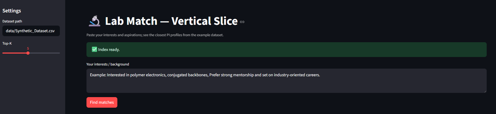
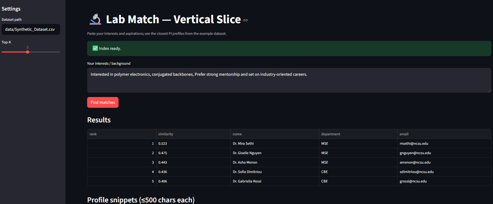

# Lab Match — Vertical Slice (Streamlit)

A Lablink demo that embeds PI/lab profiles and lets a student paste their interests and aspirations to find the closest matches.

## Quickstart

```bash
# 1) Clone/download this folder, then:
cd vertical_slice_app

# 2) (Recommended) create a venv
python -m venv .venv && source .venv/bin/activate   # Windows: .venv\Scripts\activate

# 3) Install only what we use
pip install -r requirements.txt

# 4) Run locally
streamlit run streamlit_app.py
```

> The app loads `data/Prototype Dataset.csv` and builds a cosine-similarity index with `sentence-transformers/all-MiniLM-L6-v2`.  
> Results are deterministic for a fixed model + dataset.

## Deploy to Streamlit Cloud

1. Push this folder to a GitHub repo (keep `streamlit_app.py` at the root).
2. In Streamlit Cloud: **New app → Select repo → Main file path: `streamlit_app.py`**.
3. No secrets are required for the default flow. If keys are added for using an alternative model later on, set them in **App → Settings → Secrets**.

## Deploy to Streamlit Local

1. **Clone or download** this repo (keep `streamlit_app.py` at the repo root and `data/Prototype Dataset.csv` in `data/`).
2. **Create a virtual environment** and **install dependencies** from `requirements.txt`.
3. **Launch the app** with `streamlit run streamlit_app.py` (no secrets required for the default sample).

### Windows (PowerShell)
```powershell
cd "C:\path\to\Lablink-Streamlit"
python -m venv .venv
.\.venv\Scripts\activate
pip install -r requirements.txt
streamlit run streamlit_app.py


## Structure

```
vertical_slice_app/
├─ data/
│  └─ Synthetic_Dataset.csv            # provided example profiles (no keys required)
├─ docs/
│  └─ Lablink_homepage.png             # example site running and outputs
│  └─ Lablink_output.png 
├─ src/
│  └─ core.py                          # refactored functions
├─ streamlit_app.py                    # simple UI importing src.core
├─ requirements.txt
└─ README.md
```

## Minimal dependencies

- `streamlit`, `pandas`, `numpy`, `scikit-learn`, `sentence-transformers`  
- On this slice, no keys are required. If you introduce APIs later for calling another model, use Streamlit Secrets:

```toml
# .streamlit/secrets.toml (do NOT commit)
OPENAI_API_KEY = "sk-..."
```


## Screenshots 
If the script is working you should first be presented with this page followed by this output

Homepage:

Example Output:

